[](https://github.com/daylioti/docker-commander/releases/latest)
[](https://goreportcard.com/report/github.com/daylioti/docker-commander) 
[](https://travis-ci.org/daylioti/docker-commander)

<code>docker-commander</code> is a cross-platform, customizable, execution commands in docker containers dashboard based on <a href="https://github.com/gizak/termui">termui</a>

</img>

## Installation

### Linux
```bash
sudo wget -qO- https://github.com/daylioti/docker-commander/releases/download/1.1.5/docker-commander_1.1.5_linux_amd64.tgz | sudo tar xvz --overwrite -C /usr/local/bin
sudo chmod +x /usr/local/bin/docker-commander
```
### MacOS
```bash
sudo wget -qO- https://github.com/daylioti/docker-commander/releases/download/1.1.5/docker-commander_1.1.5_darwin_amd64.tgz | sudo tar xvz -C /usr/local/bin
sudo chmod +x /usr/local/bin/docker-commander
```

`docker-commander` is also avaliable for Arch in the <a href="https://aur.archlinux.org/packages/docker-commander">AUR</a>

### Options

Option | Description
--- | ---
-api-host| docker api host, f.e tcp://127.0.0.1:2376
-api-v | docker api version, use this option when you have some troubles with docker api version.
--tty | Enable docker exec tty option with parse colors. 
-h	| display help dialog
-c  | path to yml config file or url to download yml.
-v	| output version information and exit

### Keybindings

Key | Action
--- | ---
\<Enter\> | Execute command
\<Left\>, \<Right\>, \<Up\>, \<Down\>, H, J, K, L  | Menu list controls 
\<Tab\> | Switch between terminal and menu
\<C-r\> | Remove selected process in tab. 
\<C-v\> | Paste from clipboard to input field.
\<End\>, \<Home\>, \<PageUp\>, \<PageDown\>, \<MouseWheelDown\>, \<MouseWheelUp\>, \<Up\>, \<Down\> | Scroll command output 
q, Q | Quit from docker-commander, except opened input popup
\<C-c\> | Quit from docker-commander from anywhere

## Usage

`docker-commander` requires config file to build menu, default config path - ./config.yml.
 You can also use `-c` param to specify path to yml file or url to download.
### Docker host
By default `docker-commander` tries to find local docker api client or you can specify it with 
`-api-host` param
 
### Config file
 ```yaml
  config:
  - name: "menu item name"
    config:
    - name: "another child menu item"
      config:
      - name: "item with command"
        exec: # it just example.
          connect:
            container_image: "flatland-site-reactjs-public"
          workdir: "/usr/src/site"
          cmd: "npm run-script start"
      - name: "item"
        config:
        - name: "item2"
          exec:
            connect:
              container_image: "ubuntu"
            workdir: "/var"
            cmd: "ls -lah"      
  - name: "menu item 2"
    config:
    - name: "another child menu item 2"
      exec:
        connect:
          container_image: "ubuntu"
        cmd: "ls -lah /var"
  ```
  Configuration of menu can be with any depth, yml support anchors for some optimizations
